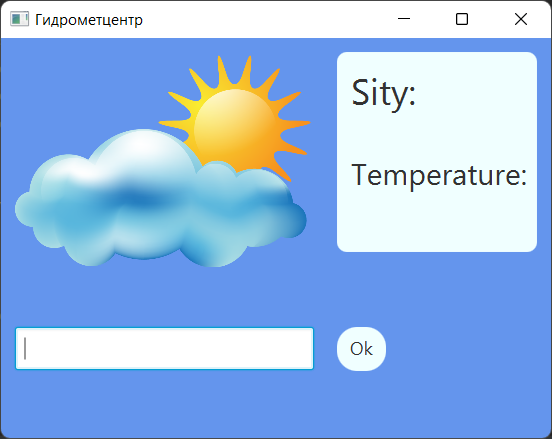
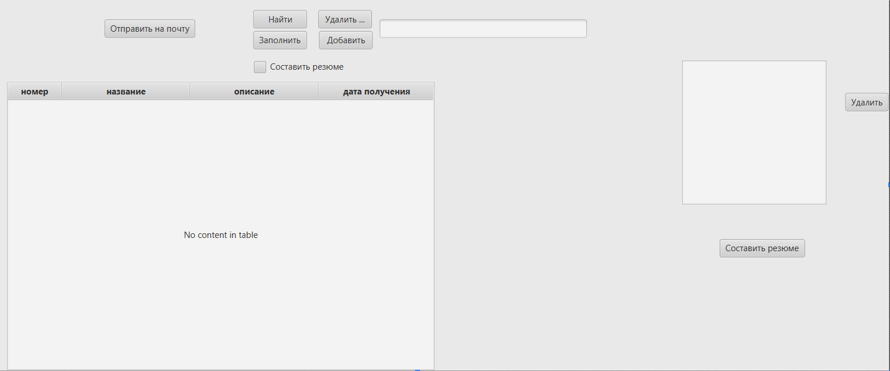

# student-project-catalog
<h1> Коллекция студенческих проектов </h1>
В каталоге представлены "хорошие" программные проекты, выполненные в ходе лабораторных работ
с использованием технологии JavaFX

## Содержание
- Функциональность
  - [Калькулятор энергопотребления](power_calculate-master/README.md)
  - [Редактор CSS-стилей для fxml-форм](EditorCSS-main/README.md)
  - [Веб-сервер совместного расписания](WebShedule-main/README.md)  
  - [Редактор плана сети](EditorPlaneNetwork-main/README.md)
  - [Сборщик файлов](#сборщик)
  - [Моделирование пожарной сигнализации](AlarmSystem-master/README.md)
  - [Метеостанция](ClientServer-master/README.md)
  - [Модуль авторизации](#versioning)
  - [Хранилище личных достижений](DataBase-developer/README.md)
  - [Аквариум](ThreadsAquarium-master/README.md)
  - [Векторный растровый редактор](GrafRedactor/README.md)
  - [Статистический анализатор для построения блоковых графиков](blocks-diagram-master/README.md)
  - [Прототип мобильного приложения Навигатор гостя Университета](UniversityNavigation-main/README.md)
- Техники
  - [Автогенерация полей](power_calculate-master/README.md)
  - [Техника чтения из файла](power_calculate-master/README.md)
  - [смена сцен](#редактор)
  - [стандартные диалоги](#сборщик)
  - [Случайная генерация событий](AlarmSystem-master/README.md)
  - [Работа с email](#basedata)
  - [Вывод в таблицу](#basedata)
  - [Поставщик-потребитель](ThreadsAquarium-master/README.md)
- Инструменты
  - [unit-тесты](AlarmSystem-master/README.md)
  - [Map](ClientServer-master/README.md)
  - [Система сборки Gradle](power_calculate-master/README.md)
  - [Система сборки Gradle](blocks-diagram-master/README.md)
  - [canvas](GrafRedactor/README.md)
  - [метод отсеивания тупиков](UniversityNavigation-main/README.md)
- Паттерны
  - [Абстрактная фабрика](power_calculate-master/README.md)
  - [Итератор](#сборщик)
  - [Цепочка обязанностей](AlarmSystem-master/README.md)
  - [Медиатор](#versioning)
  - [ADO](#basedata)
  - [Builder](blocks-diagram-master/README.md)
  - [DAO](UniversityNavigation-main/README.md)
  - [Singleton](UniversityNavigation-main/README.md)
- Архитектуруы
  - [Model-View-ViewModel (MVVM)](power_calculate-master/README.md)
  - [MVC](UniversityNavigation-main/README.md)
  - [Событийно-управляемая архитектура](AlarmSystem-master/README.md)  
  - [Клиент-серверная архитектура](ClientServer-master/README.md)
  - [Общий пассивный репозиторий](#basedata)
  - [MVC](GrafRedactor/README.md)
  - [MVP](blocks-diagram-master/README.md)
  - [Каналы и фильтры (с пассивными фильтрами)](#сборщик)
  - [Каналы и фильтры (с активными фильтрами)](ThreadsAquarium-master/README.md)
    
<!-- 
## [Веб-сервер](WebShedule-main/README.md)
  Веб-сервер, использование которого в сфере организации расписания позволит повысить эффективность выполнения операций типа составления совместного расписания. 
### Используемые методы и технологии программирования
  1. Фрейворк Spring boot.
  2. MVC архитектура.
### Паттерны 
  1. Паттерн DAO  для работы с Базой данных.
### Инструменты
  1. Unit-тесты.

## [EditorPlaneNetwork](EditorPlaneNetwork-main/README.md)
  Программный продукт предназначен для построения и отображения плана сети.
### Используемые методы и технологии программирования
   1. MVC архитектура.  
### Паттерны 
  1. Паттерн адаптер.
### Инструменты
  1. Unit-тесты.
   

  
## [Сборщик](https://github.com/vladder2312/JavaCollector.git)
 Сборщик файлов предназначен для создания листинга программного проекта.
Программный продукт позволяет собирать .java файлы в один файл внутри папки. После запуска программного продукта, необходимо выбрать директорию,в которой хранятся файлы с расширением .java. Список необходимых файлов выводится в listView. Далее, выбирается директория, куда будет записан новый файл. После, сообщение о ходе выполнения, в случае успешной или не успешной сборки. Созданный файл имеет название new.java и включает в себя все файлы из выбранной директории.
### Используемые методы и технологии программирования
  1. Использование стандартных диалогов.
### Паттерны 
  1. Паттерн Итератор для прохода по каталогу.
### Инструменты

## [Сигнализация](AlarmSystem-master/README.md)
 Система пожарной сигнализации предназначена для моделирования работы системы пожарной сигнализации. Используется событийное управление.
Датчики активируются в случайное время (шанс 30% каждую секунду). Данное событие обрабатывается следующим образом: В модель записывается номер активированного датчика и переключается цвет датчика на красный. Выводится сообщение о количестве активированных датчиках.
### Используемые методы и технологии программирования
  1. Случайная генерация событий по таймеру.
  2. Событийно-управляемая архитектура.
### Паттерны 
  1. Паттерн Цепочка обязанностей для обработки различных событий.
### Инструменты
  1. Unit-тесты.
  
  
## [Метеостанция](ClientServer-master/README.md)
  Сервер метеонаблюдения предназначен для сбора данных о температуре воздуха в разных населенных пунктах.
  Клиенты передают значения температуры в своем населенном пункте Серверу, могут запросить с Сервера температуру по названию города.
### Используемые методы и технологии программирования
  1. Клиент-серверная архитекутра с простым протоколом.
### Паттерны 

### Инструменты
  1. Использование Map для хранения неповторяющихся данных на Сервере.
   

## [basedata](DataBase-developer/README.md)
  Хранилище личных достижений предназначено для хранения личных достижений в виде описания и изображения.
  Программный продукт представляет централизованное место хранения личных достижений студента с внешней базой данных. База данных хранит информацию о названии мероприятия, кратком описании, дате проведения и файле награждения. В базу данных можно добавлять и удалять личные достижения. При добавлении достижения пользователю предоставляется возможность выбора файла, с помощью диалогового окна. Информация из базы данных выводятся в элемент TableView. Программный продукт предоставляет возможность поиска по личным достижениям. Имеется возможность отправки файла из приложения на почту. Пользователь выбирает файл с помощью диалогового окна файл и отправляет его на указанный адрес.
### Используемые методы и технологии программирования
  1. Работа с email.
  2. Вывод в таблицу.
### Паттерны 
  1. Паттерн ADO.
### Инструменты

## [Аквариум](ThreadsAquarium-master/README.md)
  Многопточное приложение, моделирующее аквариум с рыбками (потребителями) и кормом (поставщиками)
### Используемые методы и технологии программирования
  1. Обработка в потоках
  2. Синхронизация общего ресурса - аквариума (канвы для рисования)
### Паттерны 
  1. Поставщик-потребитель
### Инструменты

## [Векторый растровый редактор](GrafRedactor/README.md)
  Графический редактор позволяет создавать, просматривать, обрабатывать и редактировать цифровые изображения (рисунки, картинки, фотографии) на компьютере.  
Предполагается работа с отдельными точками изображения, которые могут строится в виде набора: «карандаш» - соединение двух точек прямой линией шириной в 1 пиксель; «пипетка» - выбор текущего цвета; «ластик».
### Используемые методы и технологии программирования
  1. MVC архитектура.
### Паттерны 

### Инструменты
  1. Панель для рисования (canvas на fxml-форме).
  2. Пипетка(ColorPicker на fxml-форме).
  3. Ползунок для выбора толщины линии( Slider на  fxml-форме).

## [Статистический анализатор](blocks-diagram-master/README.md)
  Статистический анализатор для построения блоковых графиков имеет возможность сохранения в файл и загрузки из него. Файл текстовый. Добавлять столбцы и строки можно бесконечно. Взаимодействовать можно с главным меню и с таблицей, а именно с её контекстным меню. 
### Используемые методы и технологии программирования
  1. Архитектура MVP
### Паттерны 
  1. Builder (для создания диаграммы)
### Инструменты
  1. Использование системы сборки Gradle.

## [Навигатор](UniversityNavigation-main/README.md)
  Для построения маршрута сначала необходимо ввести начальную точку в поле «От». При введении названия точки, в табличной части будут появляться возможные варианты точек, по введенным данным. Необходимо выбрать из таблицы нужную начальную точку. Таким же образом заполняется поле «До»- конечная точка.
После заполнения данных о точках, необходимо нажать на кнопку «Построить» программа проложит маршрут от и до указанных точек.
В зависимости от указанных точек программа выдаст ту карту где сейчас находится пользователь и оставит доступными для переключения только те этажи, через которые будет проложен путь пользователя. Карту можно приблизить и детально рассмотреть проложенный маршрут, для этого необходимо навести на карту и покрутить колесико мышки. Если пользователь совершил ошибку при заполнении полей формы или необходимо построить новый маршрут необходимо нажать на кнопку «Сбросить». При нажатии на эту кнопку произойдет очищение всех полей формы.
### Используемые методы и технологии программирования
  1. MVC (модель, представление, контроллер)
### Паттерны
  1. DAO
  2. Singleton
### Инструменты
  1. Cоздан метод отсеивания тупиков. -->
